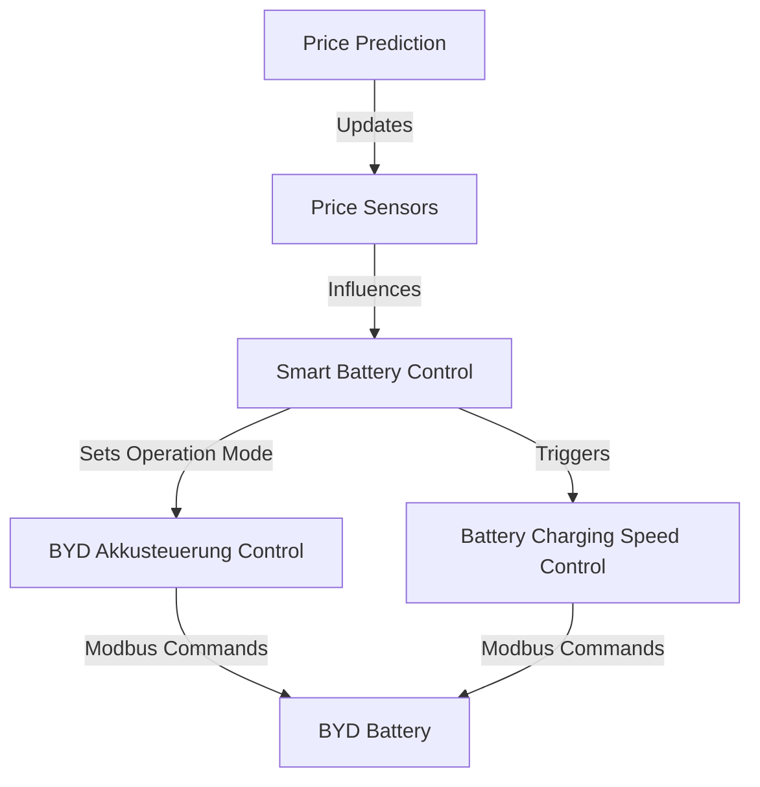

# SMA BYD Tibber Automation

This repository contains Home Assistant automations for managing a BYD battery system with SMA inverter, integrated with Tibber for smart electricity pricing.

## System Overview



## Timing and Trigger Examples

### Daily Operation Timeline

```mermaid
timeline
    title Daily Battery Operation
    section Morning
        : 06:00 : Check prices and set charging window
        : 07:00 : Start normal operation
    section Daytime
        : 10:00 : Monitor solar production
        : 14:00 : Check for high price periods
    section Evening
        : 18:00 : Peak hours - possible discharge
        : 22:00 : Off-peak - possible charging
```

### Price-Based Scenarios

1. **High Price Period (Example: 18:00-20:00)**
   ```
   17:55 - Price prediction script runs
   17:58 - Updates high_price_time sensors
   18:00 - Smart Battery Control triggers
   18:00 - Switches to Pause mode
   18:00 - BYD Akkusteuerung Control sends pause commands
   ```

2. **Cheap Charging Window (Example: 22:00-06:00)**
   ```
   21:55 - Price prediction script runs
   21:58 - Updates cheapest_charging_start
   22:00 - Smart Battery Control triggers
   22:00 - Switches to Fast Charging mode
   22:00 - Battery Charging Speed Control starts
   22:00 - Sets full power (if SOC < 70%)
   ```

### Emergency Charging Scenario

```
SOC drops to 35%:
1. Smart Battery Control triggers (every 5 minutes)
2. Detects emergency conditions:
   - SOC < 40%
   - Emergency loading enabled
   - High price period active
   - No solar production
   - No car charging
3. Switches to Fast Charging mode
4. Battery Charging Speed Control activates
5. Sets full power charging
```

## Automation Relationships and Triggers

### 1. Smart Battery Control (`smart_battery_control.yaml`)
**Main Decision Maker**

**Time-Based Triggers:**
- Every 5 minutes (e.g., 00:00, 00:05, 00:10, ...)
- Seasonal changes:
  - Winter mode: October 1st - March 31st
  - Summer mode: April 1st - September 30th

**State Change Triggers:**
- `input_select.byd_akkusteuerung` changes
- `sensor.sma_wechselrichter_battery_soc_total` updates
- `sensor.sma_wechselrichter_battery_power` changes
- `sensor.aloa_electricity_price` updates (hourly)
- Price-related sensors update

**Time-Based Decisions:**
1. Daytime (06:00-22:00):
   - Normal operation
   - Solar priority
   - Price monitoring

2. Nighttime (22:00-06:00):
   - Charging priority
   - Price-based charging
   - Emergency monitoring

3. Peak Hours (18:00-20:00):
   - Possible discharge
   - Price monitoring
   - Emergency override

### 2. Battery Charging Speed Control (`battery_charging_speed.yaml`)
**Power Management**

**Trigger Timing:**
- Every 5 minutes
- Mode changes to "BYD Akku schnell Laden"
- SOC changes

**Power Adjustment Timeline:**
1. SOC < 70%:
   ```
   Time: Any time
   Action: Full power (e.g., 5000W)
   Duration: Until SOC reaches 70%
   ```

2. 70% ≤ SOC < 80%:
   ```
   Time: After reaching 70%
   Action: 3000W
   Duration: Until SOC reaches 80%
   ```

3. 80% ≤ SOC < 90%:
   ```
   Time: After reaching 80%
   Action: 2000W
   Duration: Until SOC reaches 90%
   ```

4. 90% ≤ SOC < 95%:
   ```
   Time: After reaching 90%
   Action: 1000W
   Duration: Until SOC reaches 95%
   ```

5. SOC ≥ 95%:
   ```
   Time: After reaching 95%
   Action: Switch to normal mode
   Duration: Until next charging cycle
   ```

### 3. BYD Akkusteuerung Control (`byd_akkusteuerung_control.yaml`)
**Modbus Communication**

**Mode Change Timing:**
1. "BYD Akku schnell Laden":
   ```
   Time: When triggered
   Action:
   - Set charging mode (register 40149)
   - Set power control (register 40150)
   - Log activation
   Duration: Until mode change
   ```

2. "BYD Akku schnell Entladen":
   ```
   Time: When triggered
   Action:
   - Set discharge mode
   - Set power control
   - Log activation
   Duration: Until mode change
   ```

3. "BYD Akku Pausieren":
   ```
   Time: When triggered
   Action:
   - Set pause mode
   - Log activation
   Duration: Until mode change
   ```

4. "BYD Akku Normalbetrieb":
   ```
   Time: When triggered
   Action:
   - Set normal mode
   - Log activation
   Duration: Until mode change
   ```

## Price Integration Flow

### 1. Price Prediction Scripts
**`calculate_cheapest_window.py`:**
```
Schedule: Every hour (e.g., 00:00, 01:00, 02:00, ...)
Action: Calculate next 10 hours
Update: input_text.cheapest_charging_start
Trigger: Smart Battery Control
```

**`cost_prediction_load.py`:**
```
Schedule: Every hour
Action: Analyze price trends
Updates:
- input_text.start_high_price_time
- input_text.end_high_price_time
Trigger: Smart Battery Control
```

### 2. Price Sensors
```
Schedule: Hourly updates
Sensor: sensor.aloa_electricity_price
Trigger: Smart Battery Control
Action: Mode adjustment based on price
```

## Typical Daily Scenarios

### 1. Normal Day with Solar
```
06:00 - Start normal operation
10:00 - Solar production starts
14:00 - Peak solar production
18:00 - Solar production ends
22:00 - Check prices for charging
```

### 2. High Price Day
```
06:00 - Start normal operation
10:00 - Monitor prices
14:00 - Prepare for high prices
18:00 - Switch to pause mode
22:00 - Resume normal operation
```

### 3. Emergency Charging Day
```
06:00 - Start normal operation
10:00 - SOC drops below 40%
10:01 - Switch to fast charging
10:05 - Adjust charging power
11:00 - Monitor progress
12:00 - Return to normal when SOC > 70%
```

## Monitoring Points

1. **Battery Status:**
   - SOC changes (every 5 minutes)
   - Power flow (continuous)
   - Health status (daily)

2. **Operation Mode:**
   - Mode changes (on trigger)
   - Power adjustments (every 5 minutes)
   - Modbus commands (on mode change)

3. **Price Integration:**
   - Price updates (hourly)
   - Charging windows (hourly)
   - High price periods (hourly)

4. **System Health:**
   - Modbus communication (on command)
   - Sensor updates (various intervals)
   - Automation triggers (scheduled and event-based)

## Dependencies

- Home Assistant
- SMA Inverter with Modbus interface
- BYD Battery System
- Tibber Integration
- Python 3.x (for price prediction scripts)

## Configuration

### Required Input Entities
- `input_select.byd_akkusteuerung`: Operation mode selector
- `input_number.akkusteuerung_ladestaerke_soll`: Maximum charging power
- `input_number.high_price_threshold`: Price threshold for high price periods
- `input_text.cheapest_charging_start`: Optimal charging start time
- `input_text.start_high_price_time`: High price period start
- `input_text.end_high_price_time`: High price period end

### Required Sensors
- `sensor.sma_wechselrichter_battery_soc_total`: Battery state of charge
- `sensor.sma_wechselrichter_battery_power`: Current battery power
- `sensor.sma_wechselrichter_battery_health`: Battery health status
- `sensor.aloa_electricity_price`: Current electricity price

## Installation

1. Copy the automation files to your Home Assistant `automations` directory
2. Configure the required input entities and sensors
3. Set up the Modbus integration for your SMA inverter
4. Configure the Tibber integration
5. Set up the price prediction scripts (if using)

## Usage

The system operates automatically based on configured conditions. You can monitor the operation through:

- Home Assistant logbook entries
- Battery status in Home Assistant dashboard
- Price predictions and charging windows in the Tibber app

## Troubleshooting

Common issues and solutions:

1. **Battery not charging:**
   - Check SOC level
   - Verify emergency conditions
   - Check price thresholds
   - Monitor solar production

2. **Incorrect charging speed:**
   - Verify SOC readings
   - Check Modbus communication
   - Review charging speed thresholds

3. **Price integration issues:**
   - Verify Tibber connection
   - Check price prediction scripts
   - Review price thresholds

## Contributing

Feel free to submit issues and enhancement requests!